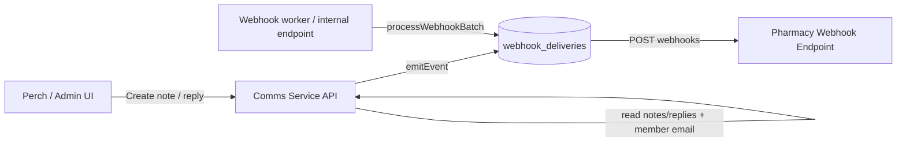

# Pharmacy Webhooks: Notes & Chat Replies

This guide describes how Pharmacy systems receive Comms Service webhooks for note creation and threaded note replies (chat replies).

## System flow diagram



## 1) Subscription setup

Create a webhook subscription for the tenant with `subscriber_system = 'pharmacy'`. The service reads subscriptions from the `webhook_subscriptions` table and delivers queued events via the worker or internal endpoint.

**Example SQL**

```sql
INSERT INTO webhook_subscriptions (
  subscription_id,
  tenant_id,
  subscriber_system,
  url,
  secret,
  event_types,
  enabled
) VALUES (
  UUID(),
  'tenant-123',
  'pharmacy',
  'https://pharmacy.example.com/webhooks/comms',
  'replace-with-shared-secret',
  JSON_ARRAY('note.created', 'note.reply.created'),
  1
);
```

## 2) Delivery headers

All webhook requests include these headers:

* `Content-Type: application/json`
* `X-Event-Id`: UUID for the event
* `X-Event-Type`: `note.created` or `note.reply.created`
* `X-Event-Timestamp`: ISO-8601 timestamp
* `X-Signature`: `sha256=<hex_hmac>` (HMAC-SHA256 of the raw request body using the `secret` from `webhook_subscriptions`)

## 3) Pharmacy webhook payloads

Pharmacy receives a normalized JSON body that is easier to consume than the raw Comms Service event. The body is:

```json
{
  "email": "patient@example.com",
  "note": "[CommsService note_id=... scope=order memberID=... orderID=...] [from=admin:Jane] [title=Shipping update]\nThe note body...",
  "note_type": "admin_note"
}
```

### 3.1 `note.created` payload

When a note is created, the `note` field is composed from the note metadata and the note body:

* Header includes: `note_id`, `scope`, `memberID`, optional `orderID`, `from`, and optional `title`.
* The note body is appended after a newline.

### 3.2 `note.reply.created` payload (chat replies)

When a reply is created, the `note` field is composed from the note metadata plus reply details:

* Header includes: `note_id`, `scope`, `memberID`, optional `orderID`, `reply_id`, optional `replied_at`, `from`, and optional `title`.
* The reply body is appended after a newline.

This keeps the Pharmacy payload shape consistent while still conveying the reply context.

## 4) Verifying signatures

To validate the webhook:

1. Read the raw request body as bytes (do not re-serialize).
2. Compute `HMAC-SHA256(secret, rawBody)` where `secret` matches the `webhook_subscriptions.secret` value.
3. Compare the hex digest to `X-Signature` (strip the `sha256=` prefix).

## 5) Delivery & retries

Webhook deliveries are queued and retried with exponential-ish backoff until success or max attempts. If the Pharmacy endpoint returns a non-2xx response, delivery will be retried automatically.

## 6) Operational notes

* Pharmacy deliveries only send `note.created` and `note.reply.created` events.
* If you only want admin notes, set `PHARMACY_ONLY_ADMIN_NOTES=true` (default).
* Make sure member emails are linked in the `members` table or delivery will fail with a 422-style error.
